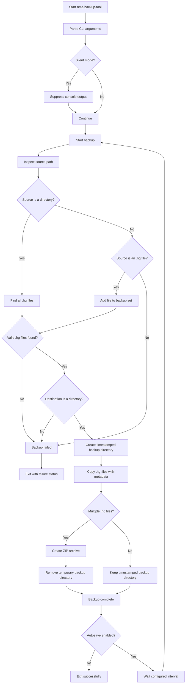

# nms-backup-tool
A simple Python script that I use to automate No Man's Sky save backups.

## Dependencies
Requires Python 3.6+ (PEP 498)

## Installation
* Download the latest release
* Extract the ZIP archive
* Run `nms-backup-tool.py` from a terminal, or use cron/task scheduler to automate it

## Usage
```
python3 ./nms-backup-tool.py -i {sourceDirectory} -o {destinationDirectory}
```

### Options
```
-h    Show help dialogue
-i    Source directory, must be an absolute path, can be a file or directory
-o    Destination directory, must be an absolute path, can be a file or directory
-s    Silent mode, suppresses console output
-s    Autosave, enables automatic backup
```

## Behavior
